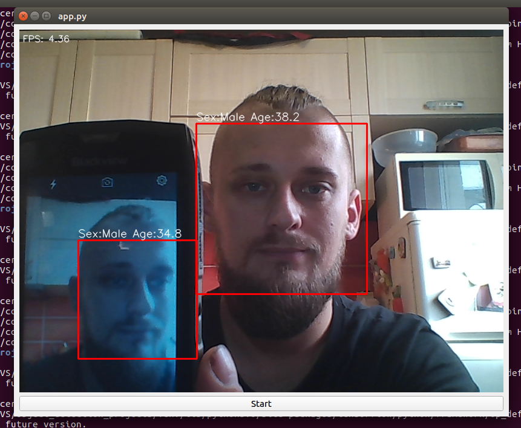

# Simple demo of using PyQt, OpenCV and Haar Cascades for face detection in real-time

Sex and age model was clonned from this repo: https://github.com/yu4u/age-gender-estimation

### Example


## How to run script
```
pip3 install -r ../requirements.txt
```

Download weights from https://drive.google.com/open?id=17Fa1Vq5qJibJfdOHY3M6yK5YVZCDofJS

Run script:
```
python3 app.py
```


